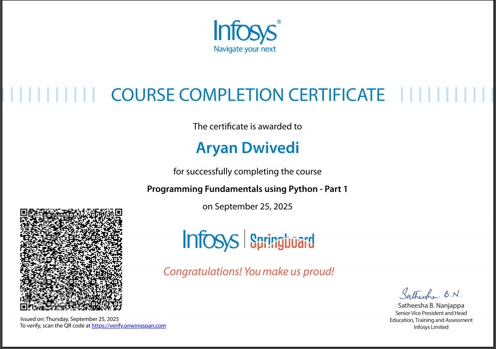
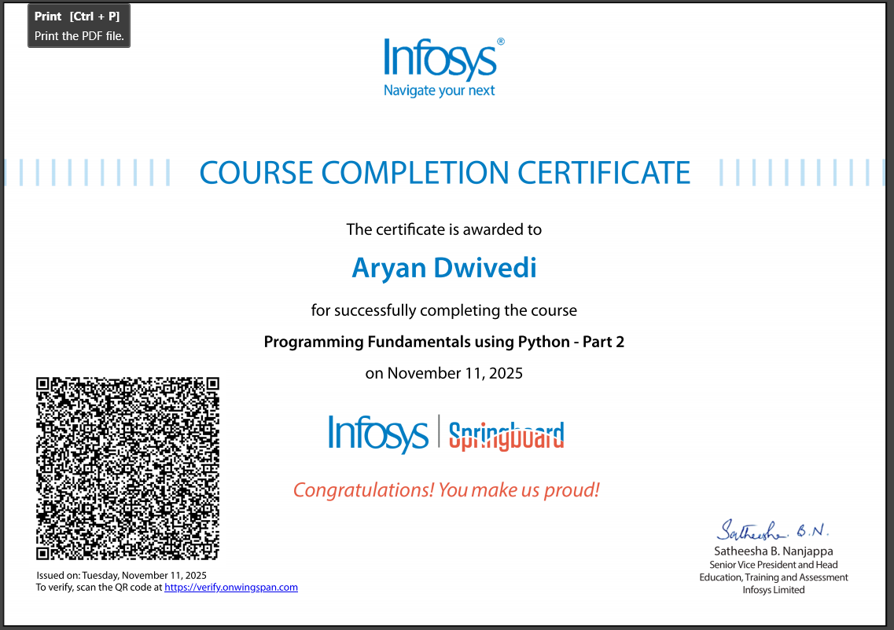
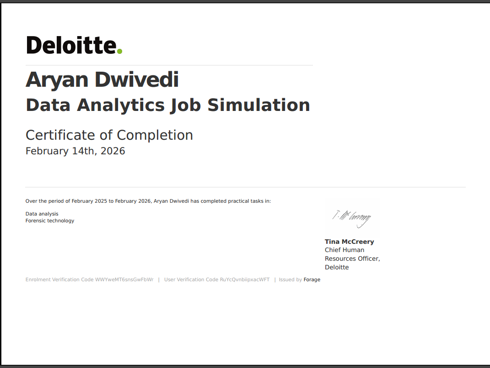
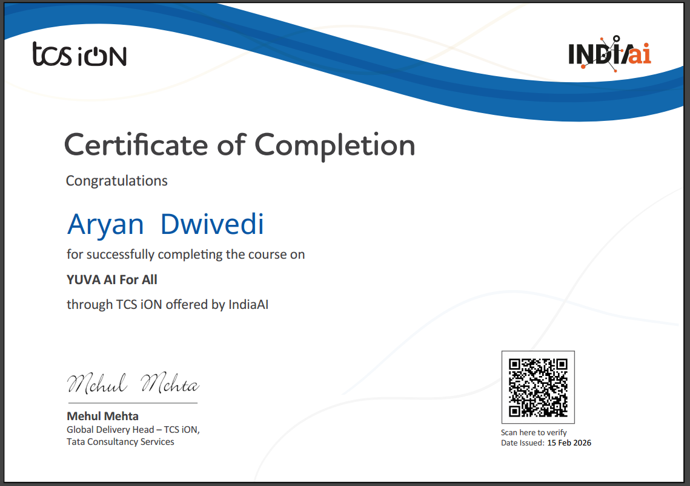
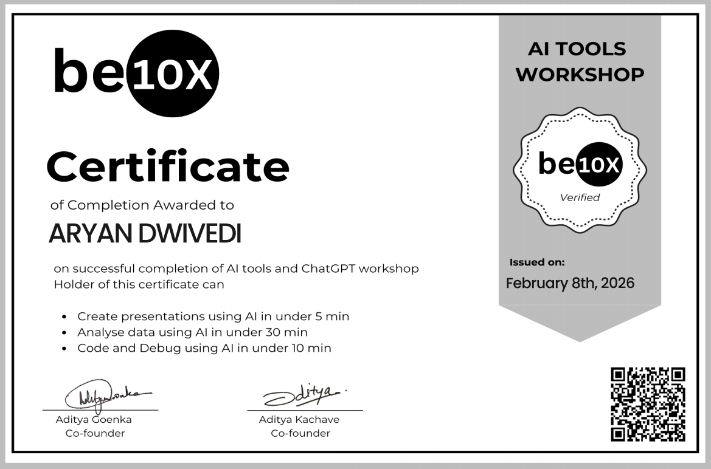

  

<h1 align="center">👨‍💻 About Me</h1>

  

* 👋 Hi, I'm **Aryan**, a **B.Tech Data Science student** passionate about working with data and discovering meaningful insights.

* 📊 Currently learning and building projects using **Python, SQL, Excel, and Power BI**.

* 📚 Strengthening my understanding of **Statistics, Data Analysis, and Data Visualization**.

* 🔎 I enjoy exploring datasets, identifying patterns, and turning complex data into **simple and useful insights**.

* 🚀 Focused on improving my skills through **hands-on projects and continuous learning**.

* 🎯 My goal is to become a **Data Analyst / Data Engineer** and use data to solve real-world problems.

## Contact Me

## Skills

&nbsp;
&nbsp;
&nbsp;
&nbsp;
&nbsp;
&nbsp;
&nbsp;
&nbsp;
&nbsp;

<h2>💼 Featured Projects</h2>
📊 Cofee Sales Analysis Dashboard Project
- Built using Excel, Power Query, Data Model
- Sales dashboard with KPI, charts, and reports.
 
🔗 Repository Link: 
 
https://github.com/aryandwivedi486-max/Coffee-Shop-Sales
<!-- Add your Projects here -->

<h2 align="left">🥇 Certifications & Badges</h2>
<table>
<tr>

<td align="center">
 
<b>Infosys Python Part 1</b>
</td>

<td align="center">
 
<b>Infosys Python Part 2</b>
</td>

<td align="center">
 
<b>Deloitte Data Analytics</b>
</td>

<td align="center">
 
<b>TCS Yuva AI</b>
</td>

<td align="center">
 
<b>AI Tools Workshop</b>
</td>

</tr>
</table>
<!-- Add your certifications and badges here -->
<table align="center">

## 🎯 What I'm Looking For

- Entry-level **Data Analyst** roles  
- **Data Analytics / Business Analytics internships**  
- Opportunities to work with **Python, SQL, Power BI, and Data Visualization**  
- Real-world projects where I can apply **data-driven decision making**

<table align="center">
<tr>
<td align="center">
 
<h2>🐍 System Processes</h2>

  

